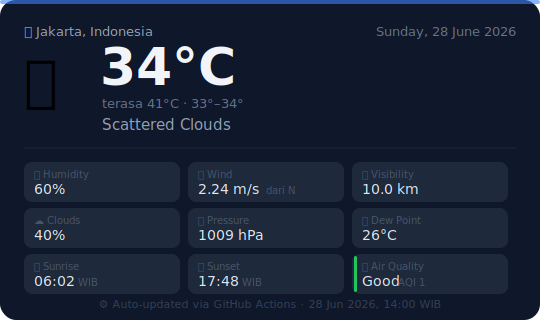

# 🌦️ Jakarta Weather Tracker

> Cuaca Jakarta diperbarui otomatis via [OpenWeatherMap](https://openweathermap.org/) · Update: 07:00 – 22:00 WIB

---

## 📊 Broken Clouds — Saturday, 27 June 2026

| | | | |
|:---:|:---|:---:|:---|
| 🌡️ | **Suhu** &nbsp; `33°C` *(terasa 39°C)* | 💧 | **Kelembapan** &nbsp; `62%` |
| 🌡️ | **Min / Max** &nbsp; `32° / 34°` | ☁️ | **Tutupan Awan** &nbsp; `54%` |
| 🌬️ | **Angin** &nbsp; `0.45 m/s` dari `W` | 👁️ | **Jarak Pandang** &nbsp; `10.0 km` |
| 🌫️ | **Tekanan** &nbsp; `1008 hPa` | 🌧️ | **Hujan (1 jam)** &nbsp; `—` |
| 🌅 | **Sunrise** &nbsp; `06:02 WIB` | 🌇 | **Sunset** &nbsp; `17:48 WIB` |
| 🏭 | **Kualitas Udara** &nbsp; Good 🟢 (AQI 1) | 🕗 | **Update** &nbsp; `27 June 2026, 13:37 WIB` |

---

## 📂 Data & Log

| File | Deskripsi |
|:---|:---|
| 📄 [weather.json](./weather.json) | Raw data cuaca terbaru dari API |
| 🎨 [card.svg](./card.svg) | Weather card (SVG) |
| 📁 [history/](./history) | Snapshot cuaca per sesi |

---

⚙️ Dijalankan otomatis oleh [GitHub Actions](../../actions) · Sumber: OpenWeatherMap API
